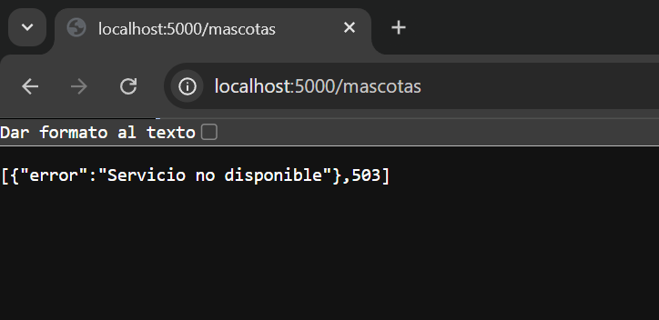
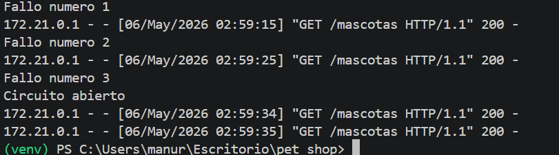
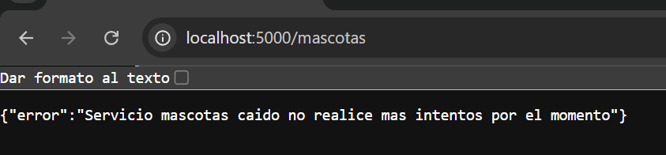
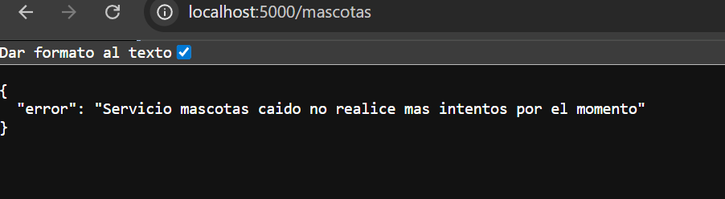
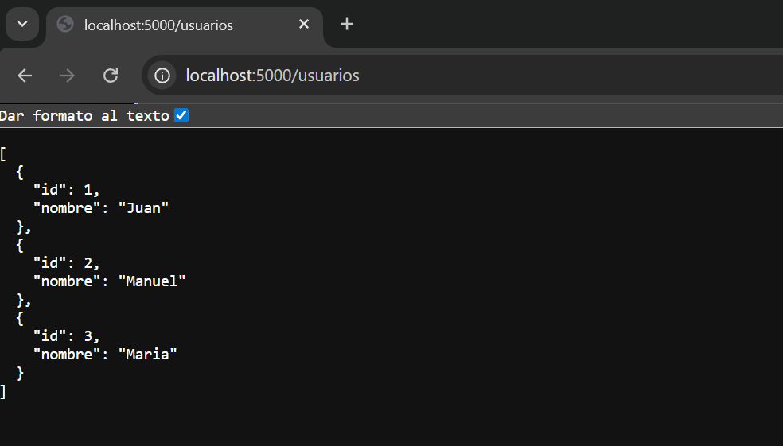
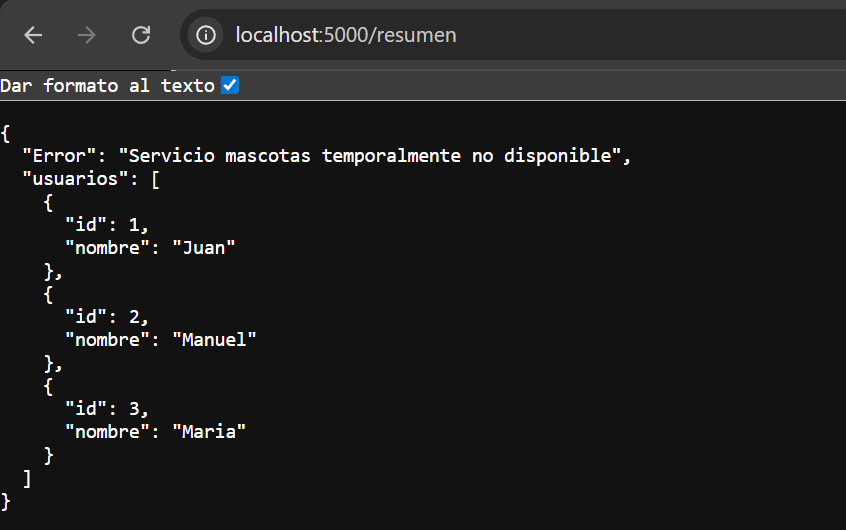
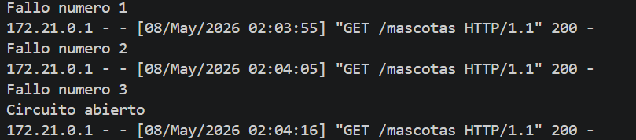
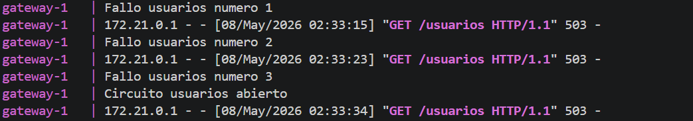
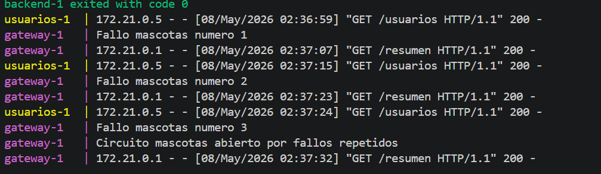
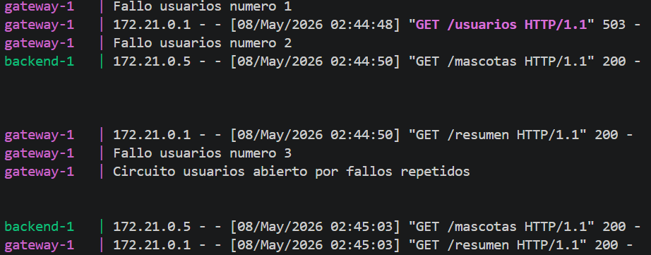

# Fase 1
**1. ¿Qué hace el sistema actualmente?**

Actualmente, el sistema intenta conectarse al servicio de mascotas cada vez que se realiza una petición al endpoint /mascotas. Como el servicio de mascotas está apagado, las solicitudes fallan y el API gateway registra cada error aumentando el contador de fallos

Después de tres fallos, el Circuit Breaker abre el circuito y el sistema deja de intentar conectarse al backend. A partir de ese momento, las nuevas peticiones ya no se envían al servicio de mascotas y el gateway responde directamente con un mensaje de error indicando "Servicio mascotas temporalmente caido".

**2. ¿Se protege o insiste?**

Al principio insiste intentando conectarse al servicio mascotas mientras ocurren los primeros fallos. Despues, el Circuit braker abre el circuito y el sistema se protege dejando de enviar solicitudes al backend.

Respuesta del Gateway al detener el contenedor:

Logs despues  de los fallos con el Circuit Breaker abierto

Mensaje de circuito abierto

# Fase 2

Durante esta fase se extendió la implementación del Circuit Breaker Pattern a los endpoints `/usuarios` y `/resumen`

Adicionalmente, el endpoint `/resumen` fue modificado para consultar ambos servicios de forma individual. Gracias a esto, si uno de los microservicios presenta fallos o tiene el circuito abierto, el otro puede continuar respondiendo normalmente, mostrando al usuario la información disponible junto con el mensaje correspondiente del servicio que no se encuentra operativo.

### Evidencias

- **Independecia**
para probar la independecia entre servicios se detuvo el servicio mascotas se realizaron las 3 solicitudes y el circuito se abre con exito:

- Al consultar el endpoint  `/usuarios` el servicio sigue mostrando la informacion correspondiente:

- tambien se pudo observar que al consultar el endpoint `/resumen` aunque el servicio de mascotas este caido, se sigue mostrando la informacion correspondiente de los usuarios, aqui podemos demostrar la tolerancia a fallos y la independencia de nuestros servicios:

- **logs**
- Aqui se muestran los logs de cuando el circuito de mascotas se abre despues de las 3 solicitudes:

- Aqui se muestran los logs de cuando el circuito de Usuarios se abre despues de las 3 solicitudes:

- Aqui se muestran los logs cuando el servicio de mascotas esta caido pero aun asi  el servicio de usuarios sigue  funcionando correctamente y se evidencia que se abre el circuito mascotas despues de las 3 solicitudes:

- Aqui se muestran los logs cuando el servicio de usuarios  esta caido pero aun asi  el servicio de mascotas sigue  funcionando correctamente y se evidencia que se abre el circuito despues despues de las 3 solicitudes:

### Analisis de la implementacion**

**¿Cada servicio debe tener su propio contador de fallos?**
Sí. Cada microservicio debe manejar su propio contador de fallos, ya que pueden presentar errores de manera independiente. En la implementación realizada, el servicio de usuarios y el servicio de mascotas cuentan con variables separadas para registrar los fallos consecutivos y controlar el estado del circuito de cada servicio.
**¿El circuito debe abrirse de forma independiente por servicio?**
Sí. El circuito debe abrirse únicamente para el servicio que presenta fallos. Esto permite que los demás microservicios continúen funcionando normalmente y evita que una falla afecte a todo el sistema. Por esta razón, se implementó un circuito independiente para usuarios y otro para mascotas.
**¿Qué pasa si falla un servicio pero el otro sigue funcionando?**
Cuando uno de los servicios falla, el otro puede continuar respondiendo normalmente. En el caso del endpoint /resumen, se adaptó la lógica para manejar cada servicio por separado. De esta manera, si uno de los microservicios no está disponible, el sistema continúa mostrando la información del servicio que sigue funcionando y reporta únicamente el servicio afectado.

# Fase 3

