# Fase 1
**1. ¿Qué hace el sistema actualmente?**

Actualmente, el sistema intenta conectarse al servicio de mascotas cada vez que se realiza una petición al endpoint /mascotas. Como el servicio de mascotas está apagado, las solicitudes fallan y el API gateway registra cada error aumentando el contador de fallos

Después de tres fallos, el Circuit Breaker abre el circuito y el sistema deja de intentar conectarse al backend. A partir de ese momento, las nuevas peticiones ya no se envían al servicio de mascotas y el gateway responde directamente con un mensaje de error indicando "Servicio mascotas temporalmente caido".

**2. ¿Se protege o insiste?**

Al principio insiste intentando conectarse al servicio mascotas mientras ocurren los primeros fallos. Despues, el Circuit braker abre el circuito y el sistema se protege dejando de enviar solicitudes al backend.

Respuesta del Gateway al detener el contenedor:

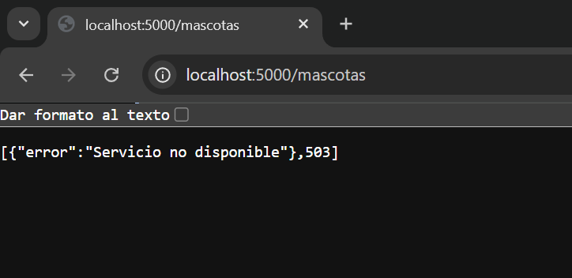

Logs despues  de los fallos con el Circuit Breaker abierto

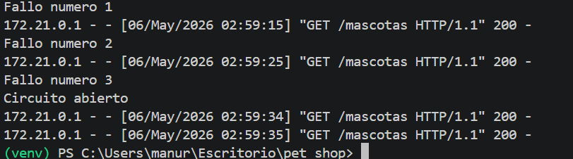

Mensaje de circuito abierto

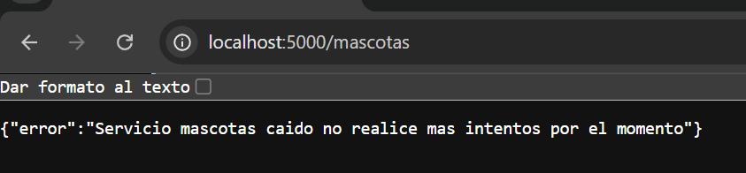

# Fase 2

Durante esta fase se extendió la implementación del Circuit Breaker Pattern a los endpoints `/usuarios` y `/resumen`

Adicionalmente, el endpoint `/resumen` fue modificado para consultar ambos servicios de forma individual. Gracias a esto, si uno de los microservicios presenta fallos o tiene el circuito abierto, el otro puede continuar respondiendo normalmente, mostrando al usuario la información disponible junto con el mensaje correspondiente del servicio que no se encuentra operativo.

### **Evidencias**

- **Independecia**
para probar la independecia entre servicios se detuvo el servicio mascotas se realizaron las 3 solicitudes y el circuito se abre con exito:

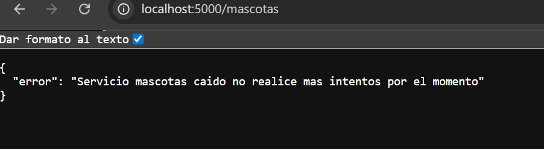
- Al consultar el endpoint  `/usuarios` el servicio sigue mostrando la informacion correspondiente:
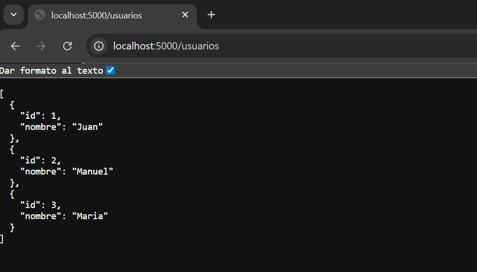

- tambien se pudo observar que al consultar el endpoint `/resumen` aunque el servicio de mascotas este caido, se sigue mostrando la informacion correspondiente de los usuarios, aqui podemos demostrar la tolerancia a fallos y la independencia de nuestros servicios:
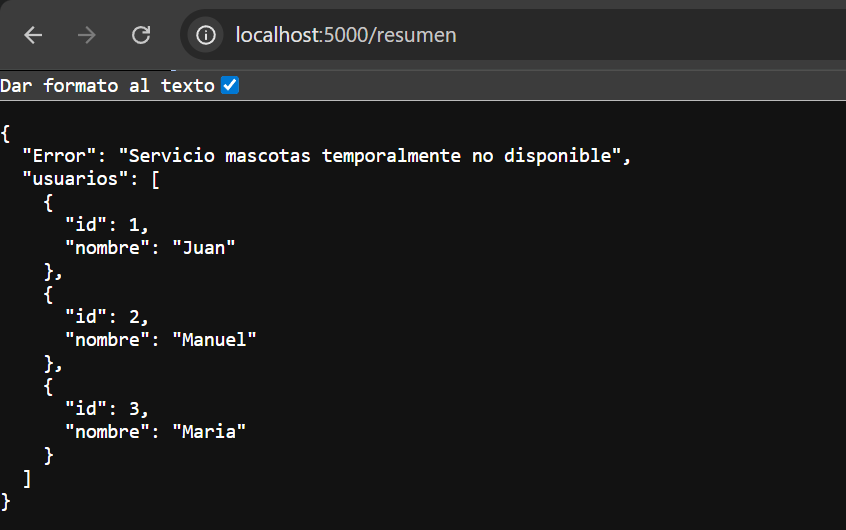

### **logs**
- Aqui se muestran los logs de cuando el circuito de mascotas se abre despues de las 3 solicitudes:
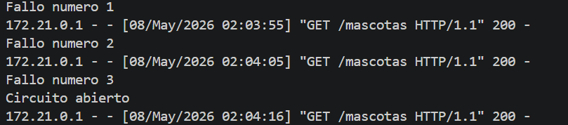
- Aqui se muestran los logs de cuando el circuito de Usuarios se abre despues de las 3 solicitudes:
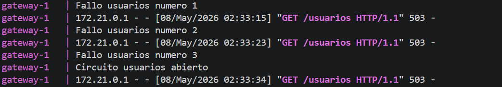
- Aqui se muestran los logs cuando el servicio de mascotas esta caido pero aun asi  el servicio de usuarios sigue  funcionando correctamente y se evidencia que se abre el circuito mascotas despues de las 3 solicitudes:
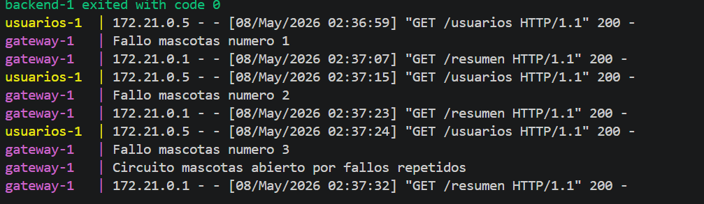
- Aqui se muestran los logs cuando el servicio de usuarios  esta caido pero aun asi  el servicio de mascotas sigue  funcionando correctamente y se evidencia que se abre el circuito despues despues de las 3 solicitudes:
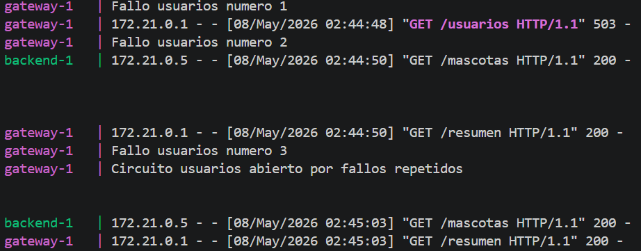

### **Analisis de la implementacion**

- **¿Cada servicio debe tener su propio contador de fallos?**
Sí. Cada microservicio debe manejar su propio contador de fallos, ya que pueden presentar errores de manera independiente. En la implementación realizada, el servicio de usuarios y el servicio de mascotas cuentan con variables separadas para registrar los fallos consecutivos y controlar el estado del circuito de cada servicio.

- **¿El circuito debe abrirse de forma independiente por servicio?**
Sí. El circuito debe abrirse únicamente para el servicio que presenta fallos. Esto permite que los demás microservicios continúen funcionando normalmente y evita que una falla afecte a todo el sistema. Por esta razón, se implementó un circuito independiente para usuarios y otro para mascotas.

- **¿Qué pasa si falla un servicio pero el otro sigue funcionando?**
Cuando uno de los servicios falla, el otro puede continuar respondiendo normalmente. En el caso del endpoint /resumen, se adaptó la lógica para manejar cada servicio por separado. De esta manera, si uno de los microservicios no está disponible, el sistema continúa mostrando la información del servicio que sigue funcionando y reporta únicamente el servicio afectado.

# Fase 3

**1. ¿Qué significa “half-open”?**
El estado half-open,  es una fase del Circuit Breaker  que ocurre después de que el circuito ha estado abierto por un tiempo.

Cuando el circuito está abierto:
- el sistema deja de enviar solicitudes al servicio caído.

Sin embargo, despues de cierto tiempo:
- el gateway realiza una pequeña prueba para verificar si el servicio ya volvió a funcionar.

En ese momento de prueba es el estado half-open (medio abierto)

**2. ¿Cuándo se vuelve a intentar una llamada?**
La llamada se vuelve a intentar después de que pasa un tiempo de recuperación configurado por el sistema.

**Por ejemplo:**
- El circuito queda abierto 
- El gateway espera 20 segundos
- luego permite una nueva solicitud de prueba

**Si el circuito funciona:**
- El circuito se cierra nuevamente
- El servicio vuelve a operar normalmente

**3. ¿Qué pasa si el servicio vuelve a fallar?**
Si después del tiempo de espera el sistema intenta nuevamente la conexión y el servicio sigue fallando:

- La prueba falla
- El circuito vuelve a abrirse completamente
- El gateway continua bloqueando solicitudes

Esto evita seguir enviando peticiones a un servidor que todavia no se ha recuperado.

### **Ejemplo practico**

**Servicio caido:**
- Fallo 1
- Fallo 2
- Fallo 3
- Circuito abierto

**Espera 20 segundos**
- El gateway intenta nuevamente hacer una solicitud

**Caso 1: El servicio ya funciona**
la peticion responde correctamente
- Circuito cerrado
- El circuito vuelve a la normalidad

**Caso 2: El servicio sigue caido**
La peticion vuelve a fallar
- El circuito se abre otra vez
- El gateway sigue bloqueando solicitudes

# Fase 4
En la Fase 4 se implementó el mecanismo de recuperación del Circuit Breaker usando el estado Half-Open.

El sistema:
- Abre el circuito despues de varios fallos consecutivos
- Espera un tiempo definido anter de volver a intentar (10 segunodos)
- Realiza una prueba de conexion al servicio

Segun el resultado:
- Cierra el circuito si el servicio responde correctamente
- O vuelve a abrirlo si el servicio continua fallando

Para implementar la Fase 4 se utilizaron variables globales para controlar el tiempo de espera y el estado Half-Open del circuito:

**Para Mascotas:**
- `tiempo_espera`
- `momento_apertura`
- `half_open`

**Para usuarios:**
- `tiempo_espera_usuarios`
- `momento_apertura_usuarios`
- `half_open_usuarios `

### Evidencias

1. El sistema intenta conectarse al servicio mascotas y ocurren fallos consecutivos

2. Despues del tercer fallo, el Circuit Breaker abre el circuito para evitar seguir enviando solicitudes al servicio caido
- **Circuito abierto**

3. luego de esperar el tiempo de recuperacion configurado, el sistema pasa al estado Half-open para realizar prueba de conexion

- **Pasando Half-open**

4. la primera prueba fallo porque el servicio todavia sigue caido, por lo que el circuito volvio a abrirse

- **Fallo numero 4 Half-open fallo- circuito abierto nuevamente**

5. Despues de una nueva espera,el sistema volvió a entrar en Half-Open y realizó otra prueba:

- **Pasando Half-open**

6. Esta vez el servicio si respondio correctamente, por lo que el circuito se cerró nuevamente y el sistema volvió a operar con normalidad:

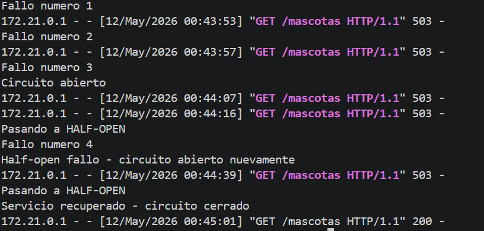

Aqui se muestra cómo el Circuit Breaker del servicio de usuarios abre el circuito después de varios fallos, rechaza solicitudes mientras está en estado OPEN, pasa a HALF-OPEN para probar la conexión y finalmente cierra el circuito cuando el servicio se recupera.

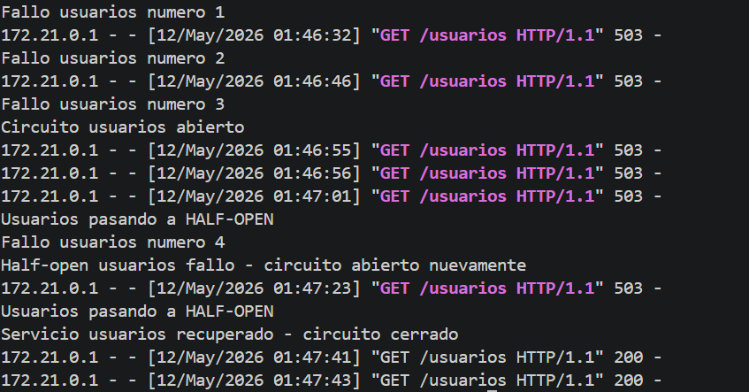

### Fase 5
Para validar el sistema se utilizo el endpoint `usuarios` probando los diferentes escenarios

1. **Servicio funcionando**
Se observa el funcionamiento normal del servicio de usuarios, respondiendo correctamente con código HTTP 200

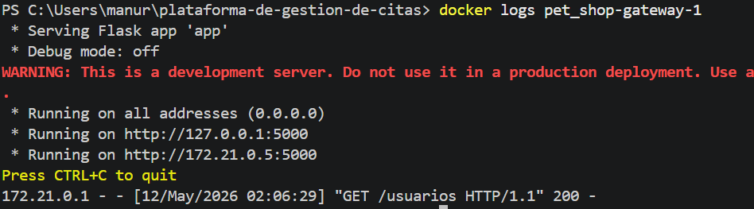

2. **Servicio Caido**
Se muestra el primer fallo del servicio de usuarios, donde el gateway registra el error y responde con código 503.

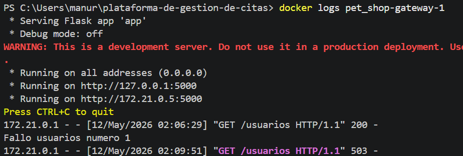

3. **Circuito abierto**
Se observan múltiples fallos consecutivos del servicio de usuarios hasta que el Circuit Breaker abre el circuito para evitar más intentos de conexión.

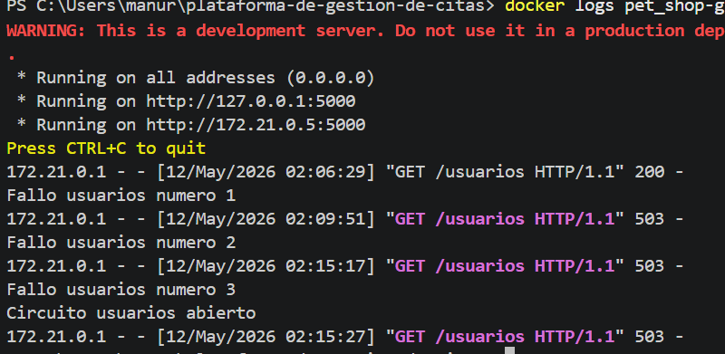

4. **Recuperacion del servicio**
Se muestra el estado Half-Open, donde el sistema realiza una prueba de recuperación y, al responder correctamente el servicio, el circuito vuelve a cerrarse.

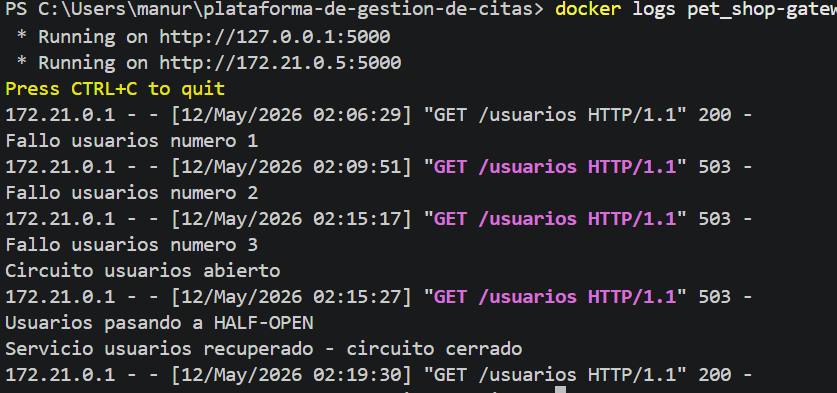

## **Analisis final**

**Que cambio en el comportamiento del sistema?**
El sistema ahora es más estable frente a fallos de los servicios. Antes, el gateway seguía intentando conectarse aunque el servicio estuviera caído, generando más errores y retrasos. Con la implementación del Circuit Breaker, el sistema detecta varios fallos consecutivos, deja de enviar solicitudes temporalmente y espera un tiempo antes de volver a intentar la conexión.

**Que decisiones se tomaron en la implementacion?**
Se decidió implementar un contador de fallos para detectar cuándo un servicio estaba fallando repetidamente. También se agregó un tiempo de espera para evitar intentos constantes de conexión y se utilizó el estado Half-Open para probar si el servicio ya se había recuperado antes de volver a cerrar el circuito completamente.

**Que dificultades se encontraron?**
Una de las principales dificultades fue entender el comportamiento de los estados del Circuit Breaker, especialmente el estado Half-Open y cuándo el circuito debía volver a abrirse. También hubo confusión al interpretar los logs y las solicitudes que aparecían en consola, además de manejar correctamente las rutas, variables globales y tiempos de recuperación durante las pruebas.

