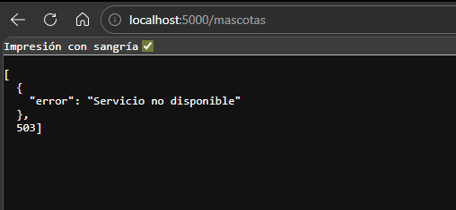
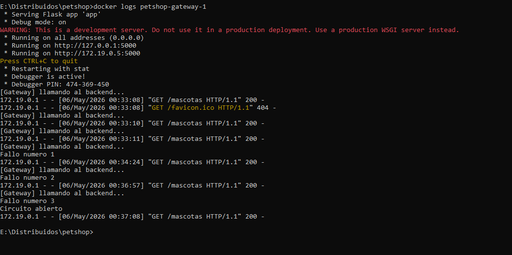
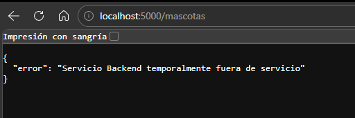
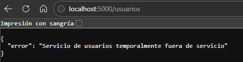
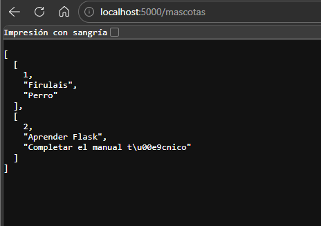
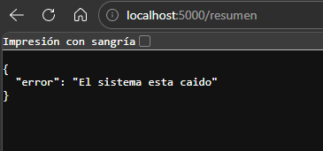
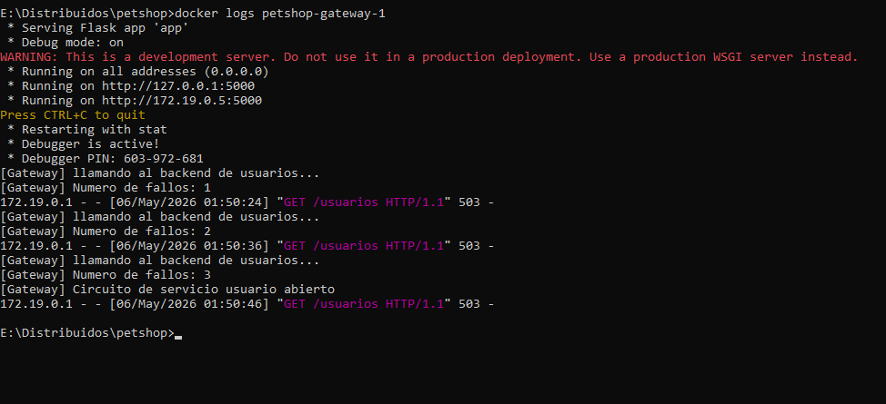
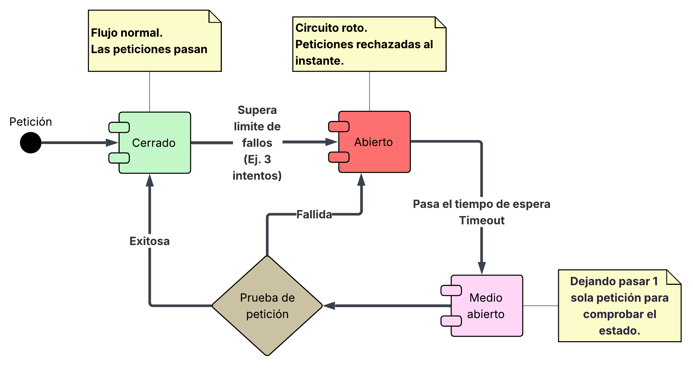

FASE 1

1. ¿Qué hace el sistema actualmente?

R/ El sistema levanta 3 servicios (backend, gateway y usuarios). El Gateway actúa como puerta de entrada, enrutando las solicitudes de los usuarios hacia los endpoints correspondientes (/usuarios, /mascotas, /mascotas/<id>, /resumen).

Actualmente, el endpoint /mascotas en el Gateway tiene una implementación de Circuit Breaker. Tiene configurado un tiempo de espera (timeout) de 2 segundos por petición. Si el servicio backend está apagado o caido, el Gateway no hace reintentos automáticos, sino que cuenta las peticiones fallidas que hace el usuario. Al acumular 3 fallos consecutivos (evidenciados en los logs), el sistema cambia su estado, abre el circuito y deja de intentar comunicarse con el backend, devolviendo un mensaje estático de error.

2. ¿Se protege o insiste?

R/ El sistema se protege. En lugar de insistir de manera infinita y quedarse esperando respuesta de un servicio caído (lo que podría saturar los recursos del Gateway), tras alcanzar el límite de 3 peticiones fallidas, el circuito se abre y corta la comunicación inmediatamente. Sin embargo, actualmente el circuito se queda abierto de forma permanente y no tiene un mecanismo para evaluar si el backend ya se recuperó.

### Evidencias Fase 1

Aquí muestro el pantallazo de cuando detuve el contenedor del backend:

Y aquí se observan los logs mostrando cómo el circuito se abre después de los 3 fallos:

Finalmente el mensaje que aparece cuando el circuito se a abierto:

FASE 2

### 1. Evidencia por fases

**Explicación breve:**
En esta fase se implementó el patrón Circuit Breaker en el resto de los endpoints del Gateway (`/usuarios` y `/resumen`), además de `/mascotas` y `/mascotas/<id>`. Se configuró la lógica para que cada servicio (`usuarios` y `backend`) tenga su propio contador de fallos y estado de circuito independiente. Además, se adaptó el endpoint `/resumen` para que, al depender de ambos servicios, si alguno de los dos falla o tiene el circuito abierto, se declare que "El sistema está caído", evitando entregar información incompleta.

**Prueba de Independencia de Circuitos:**
Para comprobar la independencia, en esta ocasión se detuvo únicamente el contenedor de **usuarios**, manteniendo el contenedor de mascotas (backend) activo.

Al hacer 3 peticiones al endpoint `/usuarios`, se observa que el circuito se abre correctamente para este servicio:

Sin embargo, al consultar el endpoint `/mascotas`, este sigue respondiendo y entregando la información sin problemas, demostrando que los circuitos están totalmente aislados:

**Prueba del endpoint /resumen:**
Al consultar el endpoint `/resumen` con el servicio de usuarios caído, el sistema detecta la falla de su dependencia y aborta la operación general, mostrando el mensaje unificado de caída:

**Logs evidenciando el comportamiento:**
Aquí se observa en la terminal cómo el Gateway registra los intentos fallidos hacia el servicio de usuarios hasta abrir su circuito, mientras que las peticiones a mascotas se procesan con éxito:

### 2. Análisis final

### 2. Análisis final

- **¿Cada servicio debe tener su propio contador de fallos?**

  R/ Sí. En la implementación se separaron las variables (`fallos_backend` y `fallos_usuarios`). Esto se debe a que son servicios independientes. Que el servicio de _usuarios_ tenga intermitencias no significa que el de _mascotas_ esté fallando. Tener contadores separados evita falsos positivos.

- **¿El circuito debe abrirse de forma independiente por servicio?**

  R/ Sí, por eso se crearon estados separados (`circuito_abierto` y `circuito_abierto_usuarios`). Esto permite aislar los fallos. Si se cae la base de datos de usuarios, solo abrimos ese circuito, permitiendo que el sistema siga atendiendo tráfico en la ruta `/mascotas` sin ningún problema.

- **¿Qué pasa si falla un servicio pero el otro sigue funcionando?**

  R/ Si son endpoints independientes (como `/usuarios` y `/mascotas`), uno falla y el otro funciona con normalidad. Pero para endpoints agregadores como `/resumen`, que dependen de múltiples servicios simultáneamente, la lógica cambia. En lugar de atrapar el error individual de un servicio, se decidió que si cualquier dependencia crítica falla, el endpoint global responde con un mensaje de "El sistema está caído", ya que su objetivo es entregar la data conjunta.

FASE 3 – INVESTIGAR (Half-Open)

**1. ¿Qué significa "half-open" (Medio Abierto)?**
R/ El estado "Half-Open" es un estado de transición o de prueba dentro del patrón Circuit Breaker. Cuando el circuito está en estado "Abierto" (Open), bloquea todas las peticiones para proteger al sistema. Sin embargo, el sistema necesita saber en qué momento el servicio caído se ha recuperado. El estado "Half-Open" permite que una cantidad limitada de peticiones (por lo general, solo una) pase hacia el backend para "probar las aguas" y verificar si el servicio ya está funcionando de nuevo.

**2. ¿Cuándo se vuelve a intentar una llamada?**
R/ La llamada de prueba no se hace de forma inmediata ni aleatoria. Se realiza **después de que ha transcurrido un tiempo de enfriamiento preconfigurado** (conocido como _timeout_ de recuperación o _sleep window_) desde el momento en que el circuito se abrió. Por ejemplo, si el tiempo de espera es de 15 segundos, durante esos 15 segundos todas las peticiones son rechazadas instantáneamente. Exactamente en el segundo 16, el circuito pasa a "Half-Open" y permite que la siguiente petición que llegue intente llegar al backend.

**3. ¿Qué pasa si el servicio vuelve a fallar?**
R/ Si la petición de prueba en el estado "Half-Open" falla (ya sea por un error de conexión, un timeout o un error 500), el Circuit Breaker asume que el servicio sigue inestable o caído. Inmediatamente, **el circuito vuelve a pasar al estado "Abierto" (Open)** y el temporizador de enfriamiento se reinicia. El sistema tendrá que esperar otra vez el tiempo completo (ej. otros 15 segundos) antes de volver a intentar otra prueba. Si, por el contrario, la petición de prueba es exitosa, el circuito se "Cierra" completamente, los contadores de fallos se reinician a cero, y el tráfico vuelve a fluir con normalidad.

