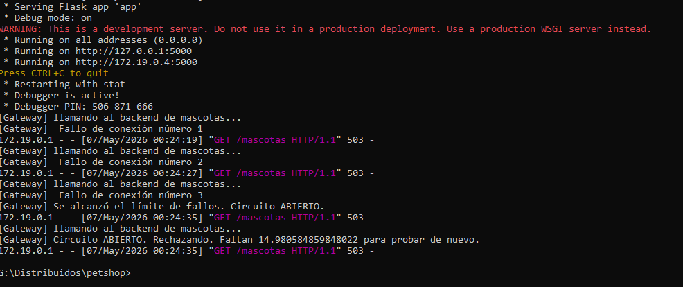
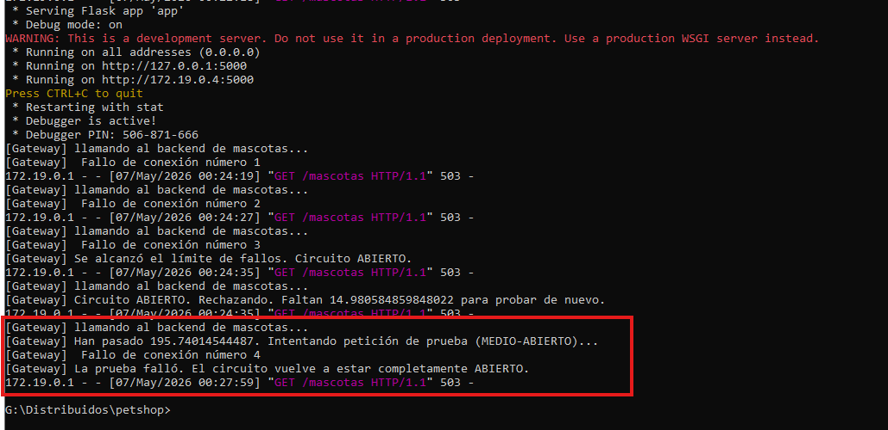
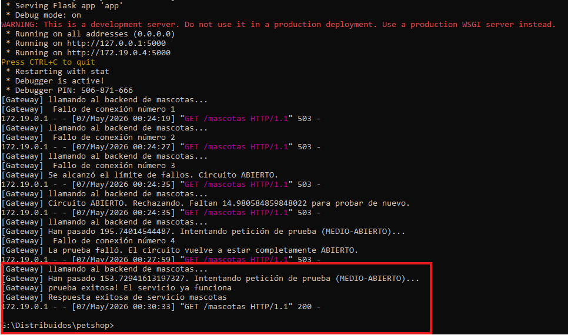
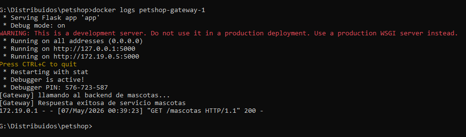
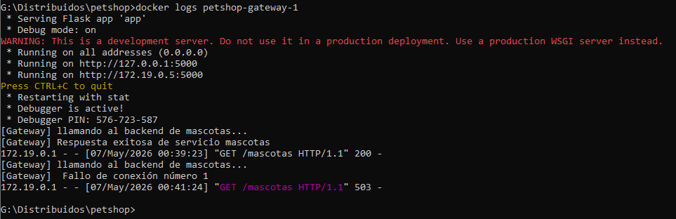
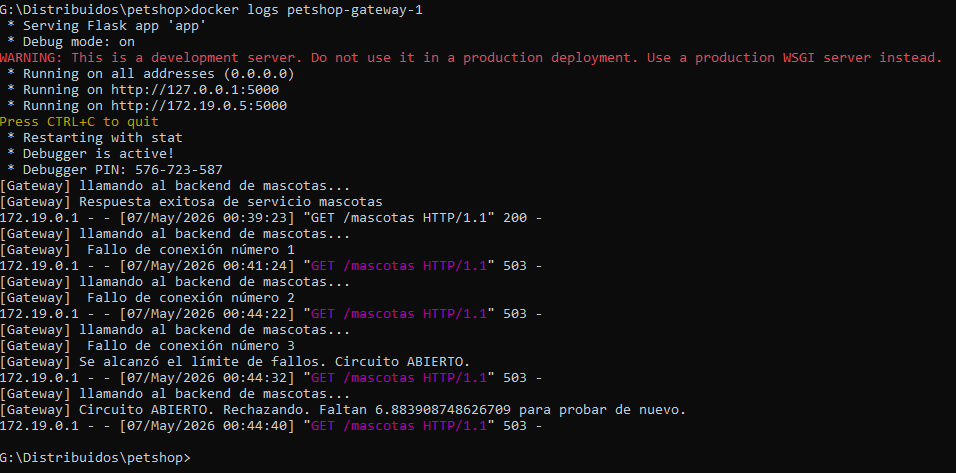
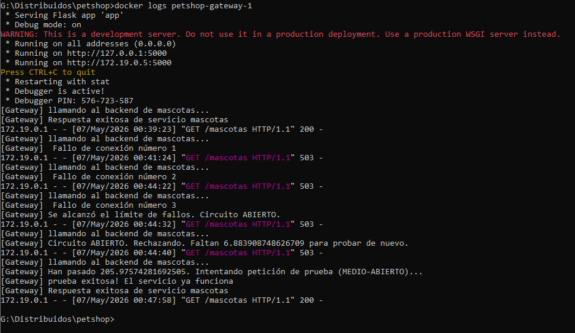

# Reporte de Implementación: Patrón Circuit Breaker

---

## FASE 1: Implementación Inicial

### Análisis del Sistema

**1. ¿Qué hace el sistema actualmente?**

> El sistema levanta 3 servicios (backend, gateway y usuarios). El Gateway actúa como puerta de entrada, enrutando las solicitudes de los usuarios hacia los endpoints correspondientes (`/usuarios`, `/mascotas`, `/mascotas/<id>`, `/resumen`).
>
> Actualmente, el endpoint `/mascotas` en el Gateway tiene una implementación de Circuit Breaker. Tiene configurado un tiempo de espera (_timeout_) de 2 segundos por petición. Si el servicio backend está apagado o caído, el Gateway no hace reintentos automáticos, sino que cuenta las peticiones fallidas que hace el usuario. Al acumular 3 fallos consecutivos (evidenciados en los logs), el sistema cambia su estado, **abre el circuito** y deja de intentar comunicarse con el backend, devolviendo un mensaje estático de error.

**2. ¿Se protege o insiste?**

> **El sistema se protege.** En lugar de insistir de manera infinita y quedarse esperando respuesta de un servicio caído (lo que podría saturar los recursos del Gateway), tras alcanzar el límite de 3 peticiones fallidas, el circuito se abre y corta la comunicación inmediatamente. Sin embargo, en esta fase el circuito se queda abierto de forma permanente y no tiene un mecanismo para evaluar si el backend ya se recuperó.

### Evidencias Fase 1

- **Detención del contenedor:** Pantallazo de cuando se detuvo el contenedor del backend.
  

- **Apertura del circuito:** Logs mostrando cómo el circuito se abre después de los 3 fallos.
  

- **Mensaje al usuario:** Mensaje que aparece cuando el circuito se ha abierto.
  

---

## FASE 2 – APLICAR (Extensión del Circuit Breaker)

### 1. Resumen de la Implementación

En esta fase se implementó el patrón Circuit Breaker en el resto de los endpoints del Gateway (`/usuarios` y `/resumen`), además de `/mascotas` y `/mascotas/<id>`. Se configuró la lógica para que cada servicio (`usuarios` y `backend`) tenga su propio contador de fallos y estado de circuito independiente.

Además, se adaptó el endpoint `/resumen` para que, al depender de ambos servicios, si alguno de los dos falla o tiene el circuito abierto, se declare que _"El sistema está caído"_, evitando entregar información incompleta.

### 2. Pruebas y Evidencias

- **Prueba de Independencia de Circuitos:**
  Para comprobar la independencia, se detuvo únicamente el contenedor de **usuarios**, manteniendo el contenedor de mascotas (backend) activo.
  - Al hacer 3 peticiones al endpoint `/usuarios`, el circuito se abre correctamente para este servicio:
    
  - Sin embargo, al consultar el endpoint `/mascotas`, este sigue respondiendo y entregando la información sin problemas, demostrando un aislamiento total:
    

- **Prueba del endpoint `/resumen`:**
  Al consultar `/resumen` con el servicio de usuarios caído, el sistema detecta la falla de su dependencia y aborta la operación general:
  

- **Logs del comportamiento:**
  El Gateway registra los intentos fallidos hacia usuarios hasta abrir su circuito, mientras que las peticiones a mascotas se procesan con éxito:
  

### 3. Análisis de la Fase 2

- **¿Cada servicio debe tener su propio contador de fallos?**

  > **Sí.** En la implementación se separaron las variables (`fallos_backend` y `fallos_usuarios`) por ser servicios independientes. Que el servicio de _usuarios_ tenga intermitencias no significa que el de _mascotas_ esté fallando. Tener contadores separados evita falsos positivos.

- **¿El circuito debe abrirse de forma independiente por servicio?**

  > **Sí.** Se crearon estados separados (`circuito_abierto` y `circuito_abierto_usuarios`) para aislar los fallos. Si se cae la base de datos de usuarios, solo abrimos ese circuito, permitiendo que el sistema siga atendiendo tráfico en `/mascotas`.

- **¿Qué pasa si falla un servicio pero el otro sigue funcionando?**
  > En endpoints independientes, uno falla y el otro funciona con normalidad. Pero para endpoints agregadores como `/resumen`, si cualquier dependencia crítica falla, el endpoint global responde con un mensaje de _"El sistema está caído"_, ya que su objetivo es entregar la data conjunta.

---

## FASE 3: Investigar (Estado Half-Open)

**1. ¿Qué significa "Half-Open" (Medio Abierto)?**

> Es un estado de transición o de prueba. Cuando el circuito está "Abierto" (Open), bloquea todas las peticiones para proteger al sistema. El estado "Half-Open" permite que una cantidad limitada de peticiones (por lo general, solo una) pase hacia el servicio caído para verificar si ya está funcionando de nuevo.

**2. ¿Cuándo se vuelve a intentar una llamada?**

> La llamada de prueba se realiza **después de que ha transcurrido un tiempo de enfriamiento** preconfigurado (_sleep window_) desde que el circuito se abrió. Por ejemplo, si el tiempo de espera es de 15 segundos, durante ese tiempo las peticiones son rechazadas. En el segundo 16, el circuito pasa a "Half-Open" y permite probar la siguiente petición.

**3. ¿Qué pasa si el servicio vuelve a fallar?**

> Si la petición de prueba falla, el Circuit Breaker asume que el servicio sigue inestable. Inmediatamente, **el circuito vuelve a estado "Abierto"** y el temporizador se reinicia. Si la prueba es exitosa, el circuito se "Cierra" completamente, los fallos vuelven a cero y el tráfico fluye con normalidad.

---

## FASE 4: Implementar (Recuperación / Half-Open)

### Lógica de Implementación

Se implementó la lógica de recuperación automática importando la librería `time` de Python y creando variables globales (`ultimo_fallo_backend` y `ultimo_fallo_usuarios`) para registrar el timestamp exacto de apertura del circuito.
Ademas de una variable de recuperacion (`tiempo_recuperacion`), el tiempo de espera.

1. **Espera controlada:** Se definió un tiempo de espera de **15 segundos**. Si un cliente hace una petición antes de este tiempo, el sistema la rechaza inmediatamente informando cuántos segundos faltan.
2. **Nuevo intento de conexión:** Pasados los 15 segundos, el Gateway permite el paso de una sola petición (estado _Half-Open_).
3. **Decisión:**
   - Si **falla**, el circuito se vuelve a abrir y el reloj se reinicia.
   - Si **funciona**, el circuito se cierra (`circuito_abierto = False`), reiniciando contadores y restableciendo el servicio.

### Evidencias Fase 4

- **Espera controlada (Rechazo inmediato):** El sistema rechaza las peticiones indicando los segundos restantes.
  
- **Prueba fallida (Apertura de circuito):** Tras 15 segundos, el backend seguía apagado. El intento falló y el circuito se volvió a abrir.
  
- **Prueba exitosa (Cierre y recuperación):** Se encendió el backend. La petición de prueba fue exitosa, el circuito se cerró y el servicio volvió a la normalidad.
  

---

## FASE 5: Validar (Pruebas)

Se sometió el sistema a pruebas de estrés controladas en el endpoint `/mascotas` para validar los 4 escenarios del ciclo de vida del Circuit Breaker.

**1. Escenario: Servicio funcionando (Circuito CERRADO)**

- **Descripción:** Todos los contenedores encendidos. El Gateway enruta sin problemas.
- **Resultado esperado:** Código HTTP 200 y JSON con la lista de mascotas.
 

**2. Escenario: Servicio caído (Fase de fallos)**

- **Descripción:** Backend de mascotas apagado. El Gateway intenta conexión, espera el timeout (2s) y devuelve error (aún no se alcanza el límite de fallos).
- **Resultado esperado:** Código HTTP 503. Logs muestran el conteo ("Fallo de conexión número 1").
 

**3. Escenario: Circuito abierto**

- **Descripción:** Se alcanza el tercer fallo consecutivo. El sistema entra en estado crítico y rechaza peticiones inmediatamente.
- **Resultado esperado:** Error 503 instantáneo. Logs muestran _"Circuito ABIERTO. Rechazando. Faltan X segundos para probar de nuevo."_
 

**4. Escenario: Recuperación del servicio (Self-Healing / MEDIO-ABIERTO)**

- **Descripción:** Se enciende el backend y se espera el tiempo de enfriamiento (15s). El Gateway deja pasar una petición de prueba.
- **Resultado esperado:** El circuito se cierra automáticamente. El cliente recibe HTTP 200. Logs muestran _"¡Prueba exitosa! El servicio ya funciona"_.
 

---

## Análisis Final del Proyecto

**¿Qué cambió en el comportamiento del sistema?**

> El Gateway dejo de ser un simple enrutador ciego a un sistema **que se recupera solo (Self-healing)**. Antes, si un servicio caía, el Gateway se quedaba permanentemente abierto. Ahora, protege sus recursos cortando la comunicación ante problemas, pero es capaz de sanarse a sí mismo probando periódicamente si el backend resucito.

**¿Qué decisiones se tomaron en la implementación?**

> 1. **Errores de logica:** Un error HTTP 404 no suma fallos al circuito, ya que el servidor está vivo; simplemente el dato no existe, eso sucede en el endpoint de buscar la mascota por id, ya que si bien no se encuentra la mascota es un indicio que el endpoint funciona.
> 2. **El endpoint que depende de otros:** El endpoint `/resumen` no hace pruebas de recuperación ni abre circuitos. Solo consume el estado global y aborta devolviendo _"El sistema está caído"_ si alguna dependencia falla.
> 3. **Endpoinds que deben compartir estado:** `/mascotas` y `/mascotas/<id>` comparten variables de estado global porque pertenencen al mismo servicio.

**¿Qué dificultades encontraron?**

> - Gestionar correctamente la concurrencia y el estado mediante variables globales (`global`) en Python.
> - Implementar la lógica de tiempo con `time.time()` para lograr la transición a Medio-Abierto sin errores de sintaxis.
> - Decidir si se hacer de manera paso a paso, o utilicar librerias como `*Circuitbreaker o CircuitError*`
> - Diseñar `/resumen` para evitar enviar JSON con estructuras incompletas reflejando de forma segura la caída del sistema.
