# Laboratorio: Sistema que aprende a fallar 

## FASE 1 - Observación

- ¿Qué hace el sistema actualmente?

El sistema actualmente implementa un Circuit Breaker parcial, aplicado únicamente sobre el endpoint /mascotas. Su comportamiento se divide en dos escenarios:
Cuando el servicio está activo, el gateway recibe la petición, la redirige al microservicio backend en http://backend:5000/mascotas, obtiene la respuesta y la retorna al cliente con normalidad. En este caso el contador de fallos permanece en cero y el circuito se mantiene cerrado.

Evidencia servicio con funcionamiento normal

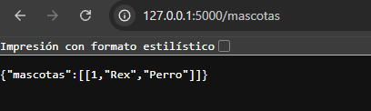

Cuando el servicio se detiene, el sistema entra en un modo de conteo de fallos. Cada petición que no logra conectarse con el backend incrementa el contador en 1, y el gateway responde con un error 503. Al momento en que ese contador supera los 3 fallos, el circuito se abre automáticamente. A partir de ese punto, el sistema deja de intentar conectarse al backend y responde directamente con el mensaje "servicio temporalmente no disponible", evitando así esperas innecesarias sobre un servicio que ya se sabe que está caído.
Adicionalmente, el endpoint /usuarios no tiene ningún tipo de protección: si ese servicio falla, el gateway no maneja el error y simplemente colapsa la petición.

Evidencia servicio caido de mascotas

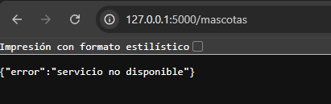

Evidencia servico de usuarios funcionamiento normal

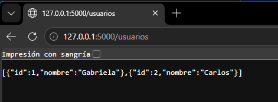

Evidencia servicio usuarios sin circuit breaker

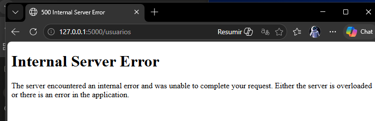

- ¿Se protege o insiste?

El sistema realiza ambas cosas, dependiendo del momento, tiene un comportamiento en dos etapas:

Primero insiste (fallos 1, 2 y 3)
Cuando el servicio backend cae, el gateway no se rinde de inmediato. En cada petición que llega intenta conectarse de todas formas, espera hasta 2 segundos (el timeout), falla, y recién ahí incrementa el contador. Esto significa que durante los primeros 3 fallos el sistema sigue golpeando un servicio que ya está caído.

Y luego se protege a partir del fallo 3 una vez que el contador llega a 3, el circuito se abre y el comportamiento cambia completamente. El gateway ya no intenta conectarse al backend, sino que responde de forma inmediata con "servicio temporalmente no disponible". Esto es la protección: respuesta rápida, sin esperas, sin intentos inútiles.

Evidencia de Logs

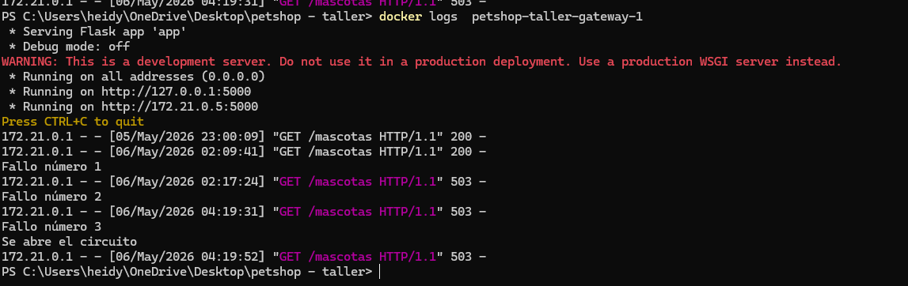

Evidencia servicio backend con el circuito abierto

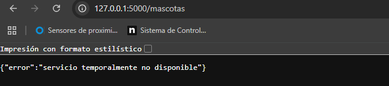

## FASE 2– APLICAR (Extensión del Circuit Breaker) 

- ¿Cada servicio debe tener su propio contador de fallos?

Sí, porque si comparten un solo contador, los fallos de mascotas afectarían el circuito de usuarios y viceversa. Son servicios independientes y deben fallar de forma independiente.

- ¿El circuito debe abrirse de forma independiente por servicio?

Sí, si backend cae pero usuarios sigue funcionando, el gateway debe seguir respondiendo /usuarios con normalidad. Si hubiera un solo circuito global, un servicio caído bloquearía a todos los demás.

- ¿Qué pasa si falla un servicio pero el otro sigue funcionando?

El usuario aún puede usar los endpoints del servicio que funciona. El gateway responde con error solo en el endpoint afectado, mientras los demás operan con normalidad.

Evidencias 

Evidencia de servicio de usuarios funcionamiento normal

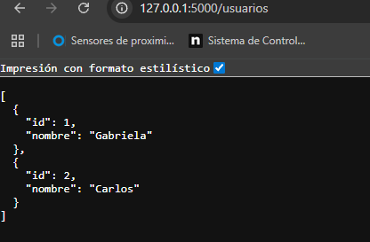

Evidencia de servicio de usuarios con Circuit Breaker

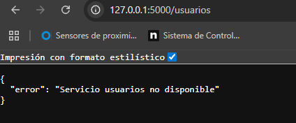

Evidencia de visualización de logs

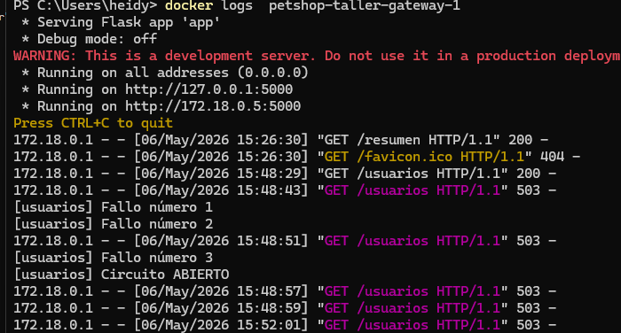

Evidencia servicio de resumen

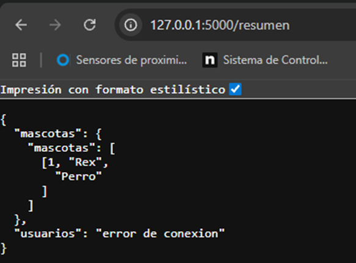

## FASE 3 - invesrigar "Half-open"

- ¿Qué significa "half-open"?

Es un estado intermedio del Circuit Breaker. El circuito estaba completamente abierto rechazando todas las peticiones, pero después de un tiempo de espera definido, permite pasar una única petición de prueba para verificar si el servicio caído ya se recuperó, sin comprometer la estabilidad del sistema.

- ¿Cuándo se vuelve a intentar una llamada?

El sistema vuelve a intentar una llamada cuando se cumplen dos condiciones simultáneamente: 

1. Que haya transcurrido el tiempo de espera definido desde que el circuito se abrió, Lo único que hace es guardar la hora exacta en que el circuito se abrió, y cada vez que llega una petición realiza una simple comparación matemática: si la diferencia entre la hora actual y la hora de apertura es mayor o igual al tiempo definido, el circuito entra en estado Half-Open y deja pasar una única petición de prueba; si no ha pasado suficiente tiempo, simplemente rechaza la petición de forma inmediata.

2. Que llegue una nueva petición que "despierte" al sistema.Si nadie hace peticiones durante horas, el sistema no hará absolutamente nada por sí solo, no importa cuánto tiempo haya pasado siempre necesita que llegue una petición para que se dé cuenta de que ya puede intentar recuperarse.

- ¿Qué pasa si el servicio vuelve a fallar?

El circuito regresa al estado abierto inmediatamente y reinicia el contador de tiempo de espera. El sistema volverá a intentar pasado ese tiempo nuevamente.

## FASE 4 - IMPLEMENTAR (Recuperación)

El sistema cuenta con Circuit Breaker implementado en los endpoints /mascotas, /usuarios y /resumen, proporcionando protección ante fallos en cada uno de los microservicios de forma independiente. Adicionalmente se implementó el estado Half-Open, el cual permite que tras un tiempo de espera de 5 segundos el sistema realice un nuevo intento de conexión con el servicio caído, cerrando el circuito si el servicio se recuperó o volviéndolo a abrir si aún no está disponible.

Servicios levantados del sistema

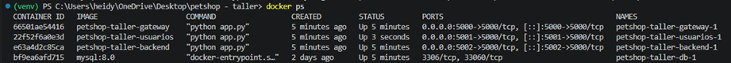

Se baja el sivicio de usuarios

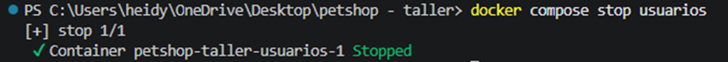

Se intenta una conexión con el servicio, al no haber una respuesta el circuito se abre y espera 5 segundos.

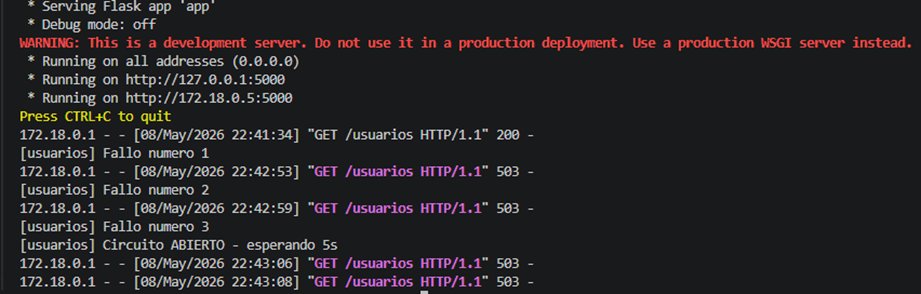

Se levanta nuevamente el servicio

Logs de cuando el servicio se recupera, se ciera el circuito y vuelve al funcionamiento normal 

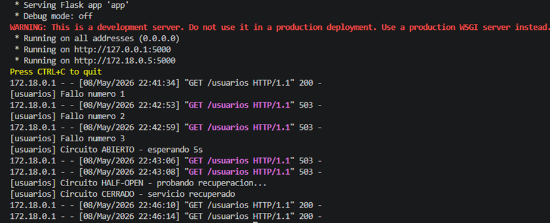

## FASE 5 - VALIDAR

A continuación se presentan las evidencias del funcionamiento del Half-Open implementado en el sistema. Se puede observar cómo ante la caída del servicio de mascotas el circuito detecta los fallos, se abre automáticamente bloqueando las peticiones, y posteriormente en el estado Half-Open realiza un nuevo intento de conexión para verificar si el servicio se ha recuperado, cerrando el circuito y restableciendo el funcionamiento normal del sistema

- Evidencia del servicio de mascotas con funcionamiento normal

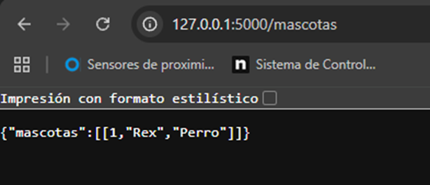

- Evidencia de que se detiene el servicio 

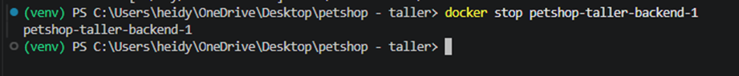

- Al alcanzar el límite de tres fallos, el circuito se abre automáticamente y el sistema responde con el mensaje de servicio no disponible, bloqueando cualquier intento de conexión posterior.
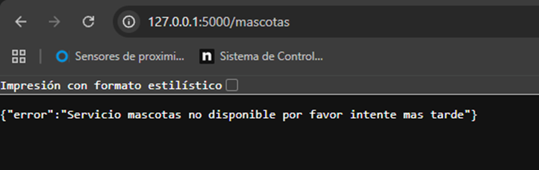

- Evidencia de los logs

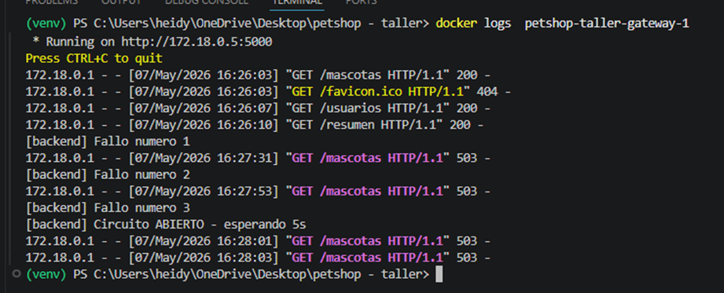

- El endpoint /resumen consulta simultáneamente ambos servicios, reflejando el estado real de cada uno. Dado que el servicio de mascotas se encuentra caído y su circuito abierto, reporta su no disponibilidad, mientras que el servicio de usuarios al estar funcionando con normalidad retorna su información correctamente, demostrando la independencia de los circuitos implementados.

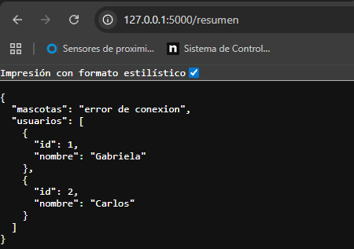

- El servicio de mascotas se levanta nuevamente
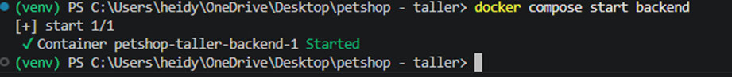

- Una vez restablecido el servicio de mascotas, el sistema detecta la recuperación a través del estado Half-Open, cierra el circuito automáticamente y retorna el funcionamiento normal del endpoint sin necesidad de ninguna intervención manual
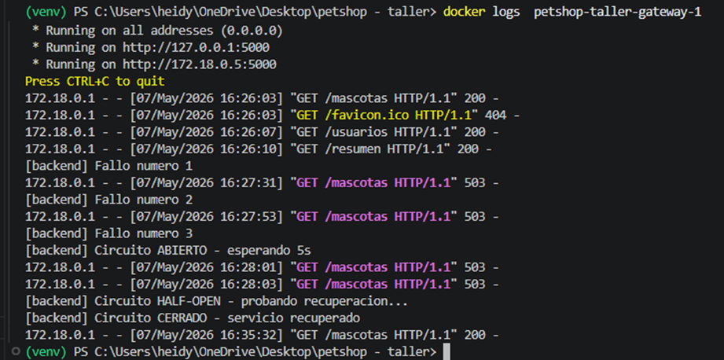

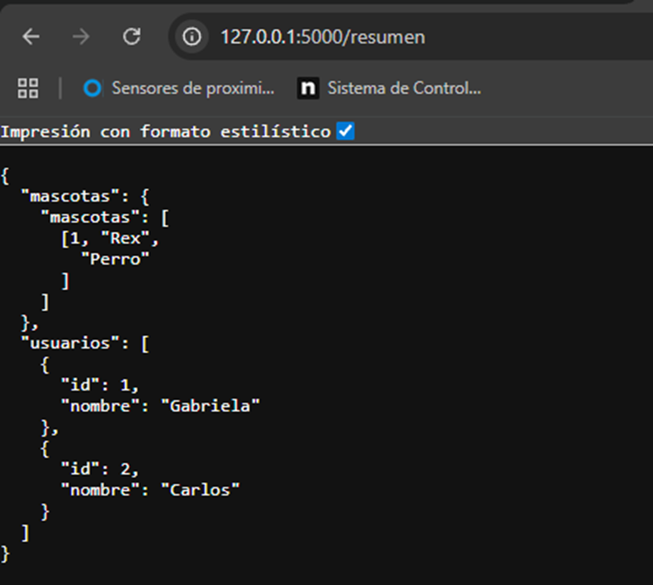

## ANALISIS FINAL 

- ¿Qué cambió en el comportamiento del sistema?

El comportamiento del sistema cambio ya que, inicialmente el gateway no tenía ningún mecanismo de protección en /usuarios y el circuit breaker de /mascotas nunca se recuperaba solo — una vez abierto, permanecía así indefinidamente hasta reiniciar el sistema. Con la implementación del Half-Open el sistema es capaz de detectar fallos, protegerse abriendo el circuito, esperar un tiempo controlado, probar la recuperación automáticamente mediante el estado Half-Open y restablecer el funcionamiento normal sin intervención. Adicionalmente, al hacer los circuitos independientes por servicio, la caída de un microservicio dejó de afectar a los demás.

- ¿Qué decisiones tomaron en la implementación?

   - Se estableció un límite de 3 fallos consecutivos antes de abrir el circuito, valor que permite detectar problemas rápidamente sin que el sistema sea demasiado sensible a errores ocasionales.
   - Se definió un tiempo de espera de 5 segundos para el estado Half-Open, lo que le da al servicio caído un margen de recuperación antes de volver a recibir peticiones.
   - Se incorporó lógica para determinar el momento adecuado en que el sistema puede realizar una nueva petición, evitando sobrecargar un servicio que aún no se ha recuperado

- ¿Qué dificultades encontraron?

La principal dificultad fue entender que el Half-Open no es un proceso automático en segundo plano, sino que depende de que llegue una nueva petición para que el sistema evalúe si ya transcurrió el tiempo de espera. Otra dificultad fue comprender la importancia de los circuitos independientes por servicio, ya que inicialmente no era evidente por qué compartir un solo circuito global era problemático. Finalmente, fue necesario entender cómo time.time() permite calcular el tiempo transcurrido guardando la hora exacta de apertura del circuito.